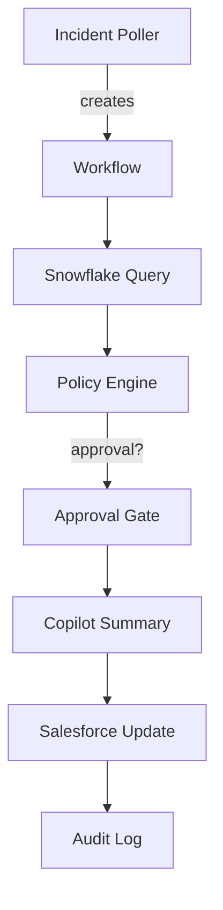

# Architecture

Sequence from incident to approval to steps:
1. Incident detected via poller.
2. Workflow runner executes Snowflake query.
3. Policy engine evaluates data tags.
4. If approval required, waits for manual gate.
5. After approval, Copilot summarizes data.
6. Salesforce case updated.
7. All actions logged and traced.
